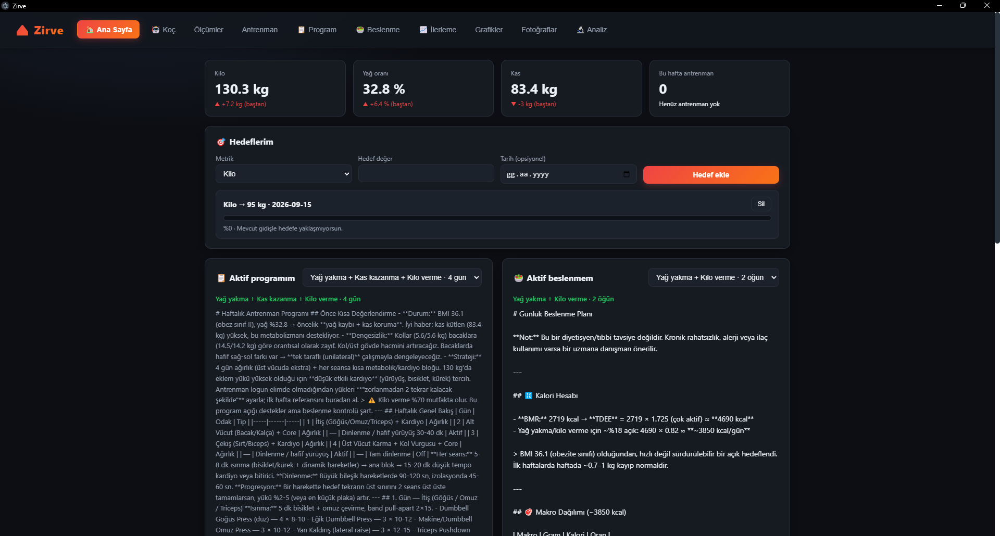
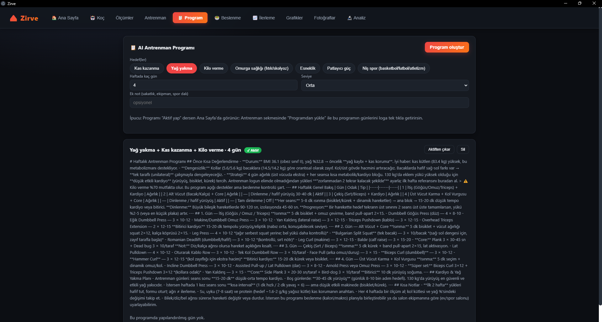
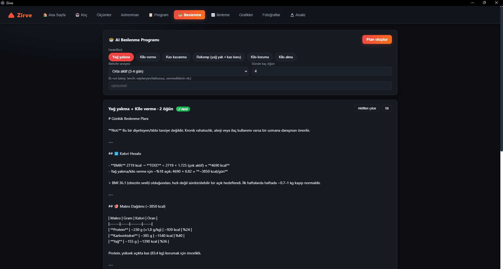
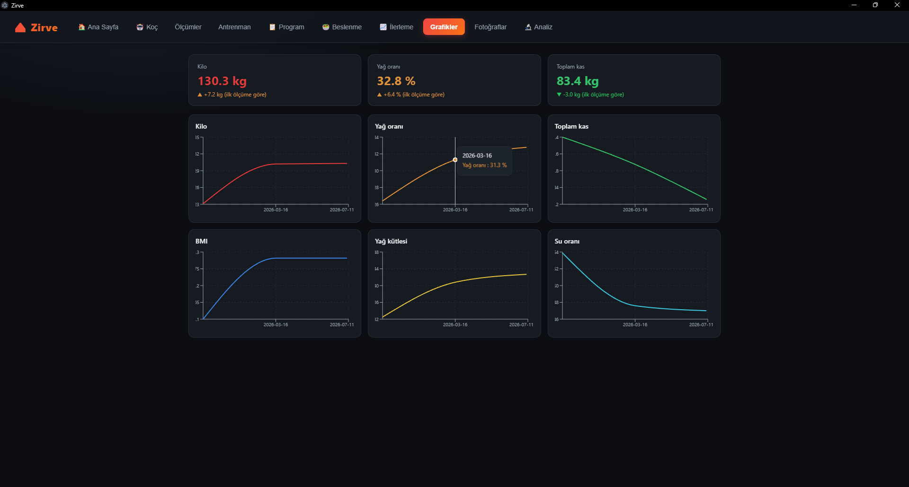
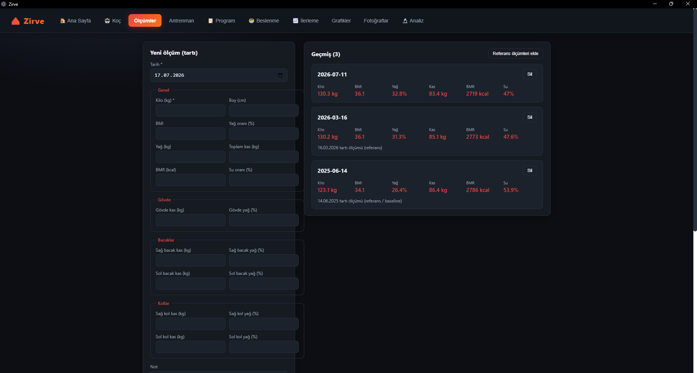

# 🏔️ Zirve — Kişisel AI Spor Koçu

**Seni tanıyan, verini hatırlayan, sohbet eden bir masaüstü dijital antrenör.**

Zirve; ölçüm ve fotoğraf takibini, **AI vücut analizini** (vision), **AI antrenman
ve beslenme programı** üretimini ve verine dayanan bir **koç sohbetini** tek bir
Windows masaüstü uygulamasında birleştirir. Ürün değil, sıfırdan tek başıma
geliştirdiğim **kişisel bir araç** — ama gerçek mühendislik kararlarıyla kuruldu.


> **Public kaynak kod.** Bu depo çalışan uygulamanın **tam kaynak kodudur.**
> Beden fotoğrafları, ölçüm klasörleri, yerel veritabanı ve geliştiricinin
> kişisel baseline ölçümleri **dahil değildir** — hiçbir kişisel sağlık verisi
> depoda yer almaz. Local-first: tüm veri kullanıcının cihazında kalır.



**Stack:** Electron 34 · React 19 · TypeScript (strict) · electron-vite (Vite 5) · sql.js (WASM SQLite) · Claude Agent SDK · `claude-opus-4-8` (vision) · recharts · electron-builder

---

## TL;DR (for reviewers)

Bir **AI spor koçunu** masaüstüne indiren, **local-first** ve **API-faturasız**
çalışan tam bir Electron uygulaması. Tek geliştirici; mimari, veri katmanı,
IPC güvenlik sınırı ve altı ayrı AI akışı (koç / analiz / program / beslenme /
ilerleme / şablon) baştan sona kurgulandı.

Bu repo bir "tutorial projesi" değil; **native derleme cehenneminden kaçınan
WASM veri katmanı, süreçler arası sıkı güvenlik sınırı, AI'dan serbest metin
değil yapılandırılmış veri alma ve fotoğraftaki yazılı tarihi okuyan vision
analizi** gibi somut problemlerin nasıl çözüldüğüdür.

| Ne kanıtlıyor | Nerede |
|---------------|--------|
| WASM SQLite ile native-derlemesiz local-first veri (+ `last_insert_rowid` tuzağı) | [`db/index.ts`](app/src/main/db/index.ts) · [`db/measurements.ts`](app/src/main/db/measurements.ts) |
| Renderer ↔ Node arasında sıkı güvenlik sınırı (contextBridge, ham ipcRenderer yok) | [`preload/index.ts`](app/src/preload/index.ts) |
| Tek tipli IPC sözleşmesi (preload + renderer aynı `SporApi`) | [`shared/types.ts`](app/src/shared/types.ts) · [`main/ipc.ts`](app/src/main/ipc.ts) |
| AI'dan serbest metin değil **yapılandırılmış** veri (defansif JSON parse → ilişkisel tablo) | [`programService.ts`](app/src/main/programService.ts) |
| ESM-only AI SDK'yi CJS main'e dinamik import + tek sefer önbellek | [`sdk.ts`](app/src/main/sdk.ts) |
| Kullanıcı verisini her mesaja otomatik bağlam enjekte eden koç | [`coachService.ts`](app/src/main/coachService.ts) |
| Fotoğraftaki **yazılı tarihi** okuyup kronolojik sıralayan vision analizi | [`analysisService.ts`](app/src/main/analysisService.ts) |

---

## Ne yapar?

| Modül | Açıklama |
|-------|----------|
| 🏠 **Dashboard** | Güncel durum, aktif program/beslenme özeti, hedef ilerlemesi |
| 🤖 **Koç** | Verine ve hedeflerine göre sohbet eden AI PT; sohbetler kayıtlı (sidebar) |
| 📏 **Ölçümler** | Tanita/tartı ölçümleri (19 alan) + çevre (mezura) ölçüleri, geçmiş liste |
| 🏋️ **Antrenman** | Set/tekrar/kg logu, hareket listesi, "Şablondan yükle" ile tek tık |
| 📋 **Program** | Hedefe + verine göre AI haftalık antrenman programı (**yapılandırılmış**: günler + hareketler) |
| 🥗 **Beslenme** | BMR/TDEE + hedefe göre kalori/makro/öğün planı |
| 📈 **İlerleme** | İki ölçüm delta karşılaştırma + AI ilerleme değerlendirmesi |
| 📊 **Grafikler** | Kilo/yağ/kas trend grafikleri (recharts) |
| 📷 **Fotoğraflar** | Poz galerisi, before/after |
| 🔬 **Analiz** | Seçili fotoğraflardan AI **vision** vücut analizi (somatotip, simetri, ilerleme) |

Hedefler çoklu seçilebilir: **kas kazanma · yağ yakma · kilo verme · omurga
sağlığı · esneklik · patlayıcı güç · niş spor.**

---

## 📸 Ekran görüntüleri

**AI antrenman programı** — hedef seç, kullanıcı verisine göre yapılandırılmış haftalık program üretilir:



**AI beslenme programı** — BMR/TDEE hesabı + hedefe göre kalori/makro/öğün planı:



**Trend grafikleri** — kilo/yağ/kas/BMI/su zaman serileri (recharts):



**Ölçüm girişi & geçmiş** — 19 alanlı tartı ölçümü + geçmiş kayıtlar:



> Ekran görüntülerindeki sayısal veriler örnek/geliştirme verisidir; beden
> fotoğrafı içeren ekranlar (Fotoğraflar, Analiz) bilinçli olarak dahil edilmemiştir.

---

## Öne çıkan teknik problemler ve çözümleri

### 1. Native derleme cehennemi yerine WASM SQLite
`better-sqlite3` gibi native modüller Electron'da her sürümde `@electron/rebuild`
ve ABI uyuşmazlığı derdi çıkarır. Kişisel/küçük veri hacmi için bunu **`sql.js`
(WASM)** ile çözdüm: DB bellekte tutulur, her yazımdan sonra tek dosyaya
`persist()` edilir. Sıfır native bağımlılık, sıfır rebuild.
→ [`app/src/main/db/index.ts`](app/src/main/db/index.ts)

**İnce tuzak:** `sql.js`'te `db.export()` çağrısı `last_insert_rowid()`'i
sıfırlar. Bu yüzden her insert helper'ında yeni id, **`persist()`'ten ÖNCE**
okunur — yoksa `getMeasurement(id)` sessizce yanlış/null döner.
→ [`app/src/main/db/measurements.ts#L37-L41`](app/src/main/db/measurements.ts#L37-L41)

### 2. Süreçler arası sıkı güvenlik sınırı
`contextIsolation: true`; renderer'a **ham `ipcRenderer` verilmez.** Preload
yalnızca dar, tipli bir `window.api` yüzeyi açar (`contextBridge`). Renderer
Node/DB'ye asla doğrudan dokunamaz — tüm veri ve AI çağrıları main process'te,
IPC üzerinden akar. Kanal adları `<alan>:<eylem>` konvansiyonunda.
→ [`app/src/preload/index.ts`](app/src/preload/index.ts) · [`app/src/main/ipc.ts`](app/src/main/ipc.ts)

### 3. Tek doğruluk kaynağı: paylaşılan IPC sözleşmesi
`SporApi` arayüzü `shared/types.ts`'te **bir kez** tanımlanır; hem preload
(implementasyon) hem renderer (tüketim) aynı tipi kullanır. Electron/React
bağımlılığı olmayan bu katman sayesinde bir kanalın imzası değişince
derleme **her iki uçta** birden hata verir — drift imkânsız.
→ [`app/src/shared/types.ts`](app/src/shared/types.ts)

### 4. AI'dan serbest metin değil, yapılandırılmış veri
Antrenman programı UI'da gün gün gösterilip düzenlenebilmeli — yani düz metin
değil **ilişkisel veri** lazım. Modeli sıkı bir JSON şemasına zorlayıp yanıtı
**defansif** ayrıştırıyorum: markdown fence'i soy, ilk `{`–son `}` aralığını al,
`days` dizisini doğrula, sonra `programs → program_days → program_day_entries`
tablolarına yaz. Bozuk çıktı sessizce değil, net hata ile geri döner.
→ [`app/src/main/programService.ts#L53-L102`](app/src/main/programService.ts)

### 5. AI beyni: Pro aboneliğiyle, API faturası olmadan
AI, kullanıcının **Claude Pro** oturumu üzerinden Claude Agent SDK ile çalışır —
ham API anahtarı ya da ekstra ücret yok. SDK **ESM-only**, main ise CJS; bu yüzden
`import()` ile dinamik yüklenip **tek sefer** önbelleğe alınır ve tüm AI
servisleri (koç, analiz, program, beslenme, ilerleme) aynı örneği paylaşır.
→ [`app/src/main/sdk.ts`](app/src/main/sdk.ts)

### 6. Koçu gerçekten "seni tanıyan" yapmak
Her koç mesajında; ölçüm geçmişi, son 12 antrenman (set×tekrar×kg) ve fotoğraf
özeti otomatik olarak bağlama enjekte edilir. Böylece koç genel-geçer değil,
**senin sayılarına atıfla** konuşur; bölgesel dengesizlikleri (kol/bacak/gövde)
ve progresif yükü yorumlar. `maxTurns: 1`, `allowedTools: []` ile deterministik
ve hızlı tutulur.
→ [`app/src/main/coachService.ts`](app/src/main/coachService.ts)

### 7. Vision analizi: dosya metadatasına değil, fotoğraftaki yazıya güvenmek
Fotoğraflar farklı dönemlerden geliyor ve dosya tarihleri güvenilmez (hepsi aynı
görünebilir). Çözüm: AI'a görselleri `Read` aracıyla **sandbox'lanmış** foto
dizininde (`cwd`) okutup, her görselin **üzerine elle yazılmış tarihi** gerçek
tarih olarak kullanmasını ve kronolojik sıralamayı kendisinin yapmasını
söylüyorum. Böylece "eski fit hâl → güncel hâl" karşılaştırması doğru kurulur.
→ [`app/src/main/analysisService.ts`](app/src/main/analysisService.ts)

---

## Mimari — Electron 3 katman

```
┌──────────────────────────────────────────────────────────────┐
│  renderer/  (React 19)   window.api.*  ← tipli, dar yüzey     │
└───────────────┬──────────────────────────────────────────────┘
                │  contextBridge  (ham ipcRenderer YOK)
┌───────────────▼──────────────────────────────────────────────┐
│  preload/    SporApi implementasyonu → ipcRenderer.invoke     │
└───────────────┬──────────────────────────────────────────────┘
                │  IPC  <alan>:<eylem>
┌───────────────▼──────────────────────────────────────────────┐
│  main/  (Node/Electron)                                        │
│    ipc.ts ── *Service.ts ──┬── db/  (sql.js WASM, local-first) │
│                            └── sdk.ts → Claude Agent SDK       │
└──────────────────────────────────────────────────────────────┘
```

```
app/src/
├── main/          Node/Electron: pencere, DB, AI, IPC
│   ├── ipc.ts         tüm IPC kayıtları tek yerde
│   ├── sdk.ts         Agent SDK lazy (ESM) yükleyici
│   ├── db/            her domain ayrı dosya (measurements, photos, chats, …)
│   └── *Service.ts    coach · analysis · program · nutrition · progress · backup
├── preload/       contextBridge → window.api (iş mantığı YOK)
├── renderer/src/  React UI — features/<alan>/ başına klasör
└── shared/        main / preload / renderer ortak tipler (SporApi)
```

---

## Kurulum & komutlar

Hepsi `app/` içinde çalışır. AI özellikleri için makinede oturum açılmış bir
**Claude Pro** hesabı gerekir (Claude Code `/login`).

```bash
cd app
npm install        # bağımlılıklar
npm run dev        # geliştirme (electron-vite)
npm run build      # üretim derlemesi
npm run typecheck  # tip kontrolü (node + web)
npm run dist       # electron-builder ile paketleme → "Zirve Setup .exe"
```

---

## Gizlilik

Tüm kullanıcı verisi (ölçüm, fotoğraf, program, sohbet) yerelde SQLite'ta,
işletim sisteminin `userData` klasöründe tutulur. Buluta veri gönderilmez;
fotoğraflar yalnızca analiz anında Agent SDK'ye gider, kalıcı olarak dışarı
çıkmaz. Beden fotoğrafları ve ölçüm klasörleri bu depoya **dahil değildir**
(`.gitignore`).

---

## İletişim

**Yavuz Selim Canpolat** · [LinkedIn](https://www.linkedin.com/in/yavuz-selim-canpolat-/) · [GitHub @yavuzscnplt](https://github.com/yavuzscnplt) · yavuz7500@gmail.com

_Kişisel kullanım için geliştirilmiştir. Ticari ürün değildir (`UNLICENSED`)._
